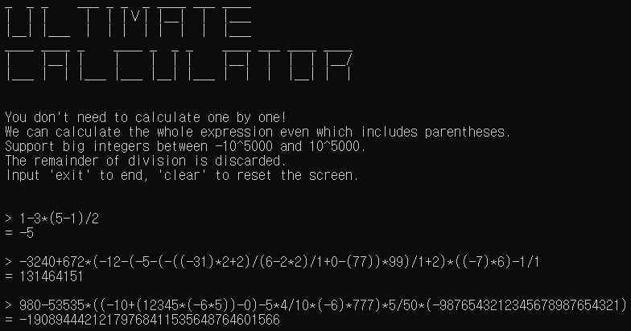

# calculator-in-c
### Goal : Implement a calculator for big integers.

* Leader
  * 나종우 (20181401)
* Members
  * 김수혁 (20180003)
  * 양원우 (20180369)
 

## Usage
Support an integer more than -105000 and less than 105000. 
All intermediate calculation results must be within the range. 
The maximum formula length is 50000 bytes.

## Roles
* 나종우 : Manage the project & repo. Implement converting to postfix notation and calculating + BigInt.
* 김수혁 : Implement getting an user input & showing the result. Make Intro.
* 양원우 : Implement main function. Make an ending message.

## Progress
* 2018/05/27 : Make this repository & README.md.
* 2018/05/28 : Edit the members list. Add a reference link about Git.
* 2018/05/29 : Distribute roles. Add reference links about Stack and Postfix Notation.
* 2018/05/29 : Start Development.
* 2018/05/31 : Build version 0.1 (support only 64-bit integers)
* 2018/06/02 : Begin developing BigInt.
* 2018/06/06 : Build version 0.2 (support big integers)

## Reference
* http://zipi.ga/n
* https://ko.wikipedia.org/wiki/%EC%8A%A4%ED%83%9D
* https://en.wikipedia.org/wiki/Reverse_Polish_notation
